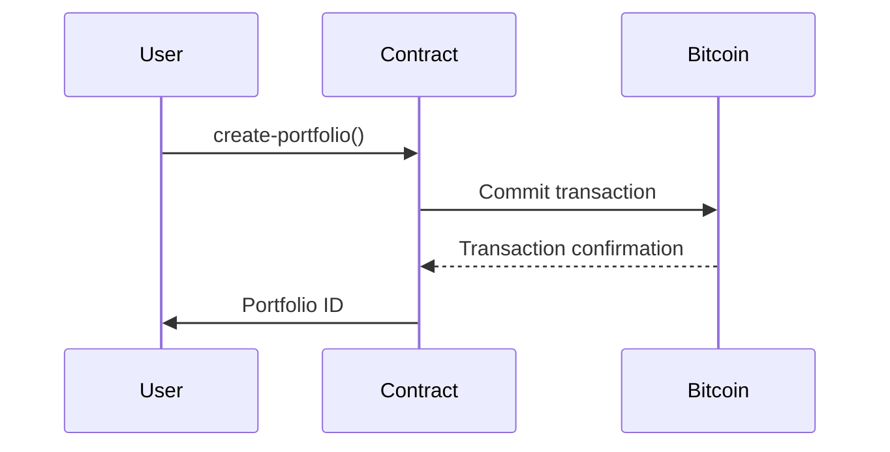

# SmartAlloc Protocol


SmartAlloc is a decentralized portfolio management protocol offering automated asset allocation and rebalancing with Bitcoin-native security through the Stacks blockchain. Designed for both novice and advanced users, it enables creation of customized token portfolios with programmatic rebalancing strategies.

## Features

- **Bitcoin-Secured** - Leverages Stacks consensus for Bitcoin finality
- **Multi-Asset Portfolios** - Support for up to 10 tokens per portfolio
- **Programmatic Rebalancing** - Automated allocation maintenance
- **Non-Custodial** - Full control over digital assets
- **Low Fees** - 0.25% protocol fee on transactions
- **Transparent** - Fully auditable on-chain operations

## Smart Contract Functions

### Core Operations

| Function | Parameters | Description |
|----------|------------|-------------|
| `create-portfolio` | `(initial-tokens, percentages)` | Initialize new portfolio |
| `rebalance-portfolio` | `(portfolio-id)` | Execute rebalancing |
| `update-portfolio-allocation` | `(portfolio-id, token-id, new-percentage)` | Modify target allocation |

### Query Operations

| Function | Parameters | Returns |
|----------|------------|---------|
| `get-portfolio` | `(portfolio-id)` | Portfolio details |
| `get-portfolio-asset` | `(portfolio-id, token-id)` | Asset allocation data |
| `get-user-portfolios` | `(user)` | User's portfolio list |

## Error Codes

| Code | Description | Resolution |
|------|-------------|------------|
| 100  | Unauthorized access | Verify permissions |
| 101  | Invalid portfolio | Check portfolio ID |
| 102  | Insufficient balance | Deposit required funds |
| 103  | Invalid token | Verify token contract |
| 104  | Rebalance failed | Check portfolio status |
| 105  | Duplicate portfolio | Use unique identifiers |
| 106  | Invalid percentage | Sum must equal 100% |

## Getting Started

### Prerequisites

- [Clarinet](https://docs.hiro.so/clarinet)
- Stacks.js
- Node.js 16+

### Installation

```bash
git clone https://github.com/johnfridayh8/automated-portfolio-management.git
cd smart-alloc
npm install
```

### Example Usage

**Create Portfolio**
```clarity
(contract-call? .smartalloc create-portfolio 
  (list 'ST1PQHQKV0RJXZFY1DGX8MNSNYVE3VGZJSRTPGZGM.token-a 
        'ST1PQHQKV0RJXZFY1DGX8MNSNYVE3VGZJSRTPGZGM.token-b)
  (list u5000 u5000))
```

**Rebalance Portfolio**
```clarity
(contract-call? .smartalloc rebalance-portfolio u1)
```

## Fee Structure

| Operation | Fee | Description |
|-----------|-----|-------------|
| Creation | 0% | No upfront cost |
| Rebalance | 0.25% | Protocol fee in basis points |
| Allocation Change | 0% | Free parameter updates |

## Security Model

- **Battle-Tested** - Inherits Bitcoin's proof-of-work security
- **Threshold Checks** - All percentage allocations validated on-chain
- **Time Locks** - Minimum 144 blocks between rebalances
- **Owner Controls** - Protocol admin safeguards



## Contributing

1. Fork repository
2. Create feature branch (`git checkout -b feature/improvement`)
3. Commit changes (`git commit -am 'Add new feature'`)
4. Push branch (`git push origin feature/improvement`)
5. Open Pull Request
